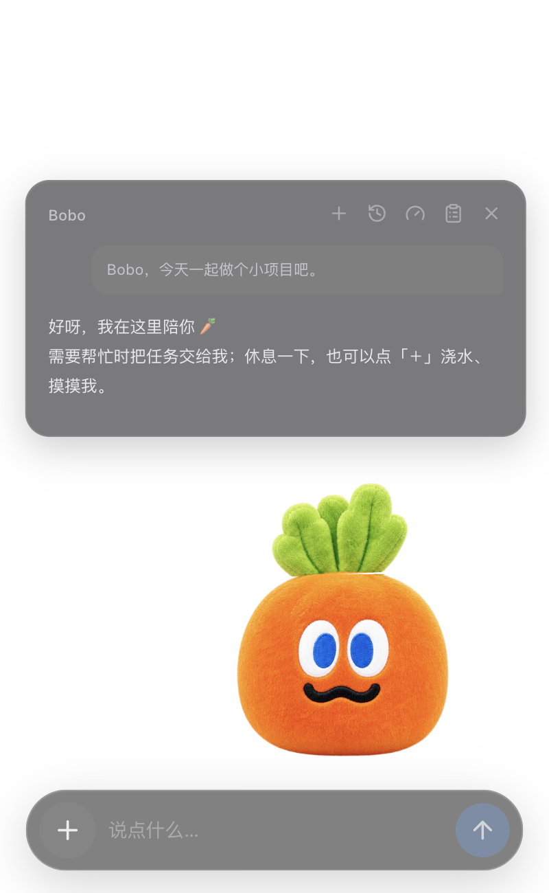
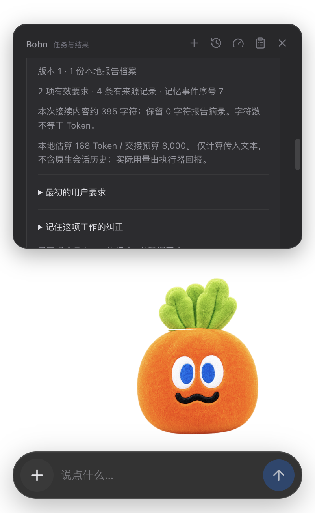
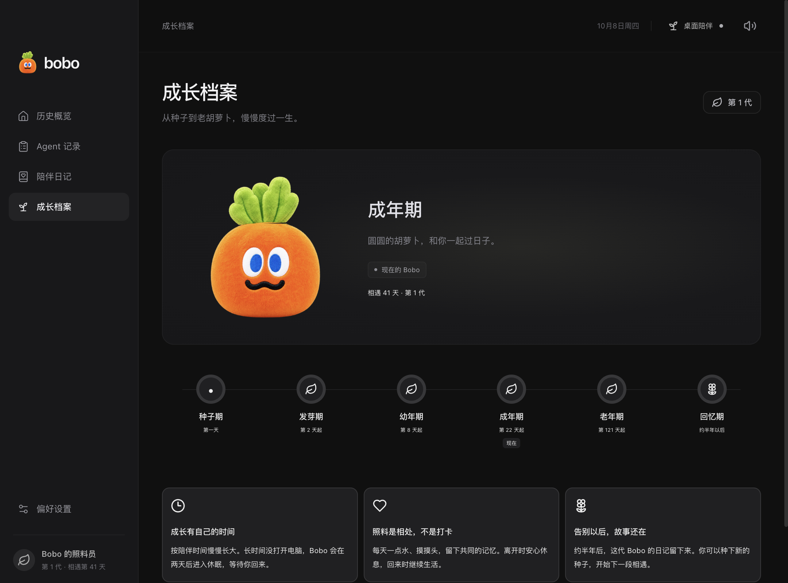
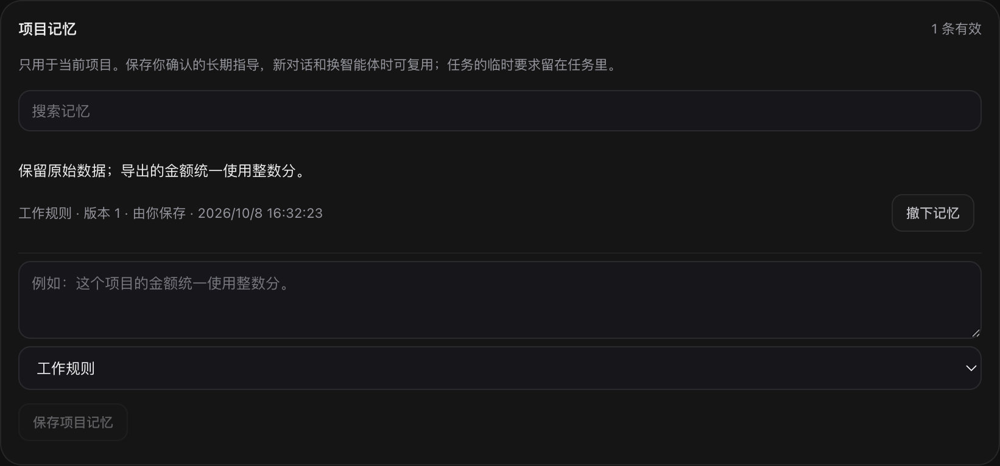
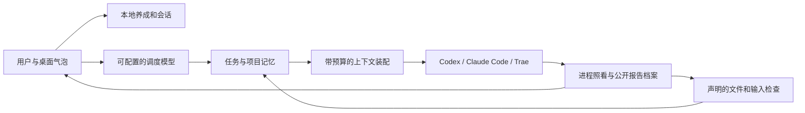

<div align="center">
  
  <h1>Bobo 🥕</h1>
  <p><strong>桌面上的胡萝卜宠物，替你照看正在工作的智能体。</strong></p>
  <p>A growing desktop companion and a local agent keeper.</p>
  <p>Electron · React · TypeScript · Local-first · Prototype</p>
</div>

Bobo 从花盆里的一颗种子慢慢长大，陪你浇水、聊天、工作，最终老去，留下这一代的陪伴记录。需要干活时，它可以照看 Codex、Claude Code 和 Trae/Coco 的本地 CLI 任务，记录额度、处理获准的接续，并把原话、纠正和可核查的证据带给下一个执行器。

日常入口是**桌宠和对话气泡**。历史记录、项目记忆和设置窗口需要时再打开。自然语言调度可连接你配置的模型服务；养成、记录和直接派发 CLI 任务不依赖调度模型。

## 实际产品界面

以下为实际 Electron 应用的界面截图，使用隔离的演示存档、示例会话及本地测试执行器。没有真实账户额度、私人对话或项目数据。

<table>
  <tr>
    <td align="center" width="50%"><br/><sub>桌面陪伴：点一下就能聊，照料入口收在「＋」。</sub></td>
    <td align="center" width="50%"><br/><sub>工作记忆：原话、纠正、档案、版本与验收可回查。</sub></td>
  </tr>
</table>





<sub>截图可通过 `npm run capture:product` 在临时存档中重新生成，不调用付费模型。</sub>

## 已经能做什么

| 功能       | 当前行为                                                                                  |
| ---------- | ----------------------------------------------------------------------------------------- |
| 桌面陪伴   | 拖动、呼吸、叶片摆动、眼神与眨眼、触摸/浇水反馈、睡眠；支持减少动效                       |
| 成长与代际 | 种子 → 发芽 → 幼年 → 成年 → 老年 → 回忆；约 180 个累计陪伴日，结束后培育下一代            |
| 会话管理   | 新建对话、搜索/切换历史、按会话保留草稿与关联任务                                         |
| 额度管理   | Codex App Server 与 Claude OAuth usage 读取；标明来源、新鲜度和重置窗口，读取失败显示未知 |
| 本地任务   | Codex、Claude Code、Trae/Coco CLI；记录真实进程状态、公开报告和已回报用量                 |
| 自动照看   | 确认终止事件后有限恢复；同工具优先原生 session，换工具只使用获准接手名单                  |
| 接续与验收 | 原目录、原权限；保留原话、纠正/撤销、文件变动和公开报告引用，运行声明的文件检查           |
| 项目记忆   | 用户确认的规则/偏好/参考位置跨会话复用；按项目隔离、可检索、可撤下                        |

豆包目前是**手动转交卡片**。Trae 使用支持 print/stream-json 的 `traecli` / Coco，不能泛化为控制任意 IDE。Bobo 只自动照看自己创建的任务；不接管你在其他窗口随手启动的所有 Agent。

## 算法与工程亮点

Bobo 的设计重点是减少长任务中「换工具后重新解释」「旧证据继续被当作有效」「反复压缩丢掉要求」这些问题。以下是已实现的组合设计，不是对全行业算法新颖性或效果优越性的证明。

### 1. 将用户要求与工作报告分开记忆

要求、验收、纠正、检查点和证据保存为有类型的记录，带来源、版本与历史。有效要求保持原话；撤销显式传给后续会话。Agent 的公开报告标为未经验证，不直接升格成可靠项目经验。

内容指纹避免对同一记录反复写入；记忆序号记录 Bobo 已处理的实质变更。动画、额度刷新和普通工具进度不会触发额外的模型总结。

实现：[work-memory.mjs](electron/work-memory.mjs)、[task-memory.mjs](electron/task-memory.mjs)。

### 2. 让证据随声明依赖失效

文件检查关联输出哈希、声明的输入哈希和验收条件版本。**输入 CSV 变了，即使输出 JSON 没变，相关旧检查也需要复核。**旧检查曾通过的记录仍保留，当前有效性单独判断。仅调整预算不会让验收失效。

这是声明依赖的版本检查，不会自动证明业务语义正确，也不能发现全部外部接口或环境变化。

实现：[workflow.mjs](electron/workflow.mjs)，回归：[workflow.test.mjs](tests/workflow.test.mjs)。

### 3. 按预算装配上下文，超限时保留要求并暂停

```text
必需内容 = 原始要求 + 有效/撤销纠正 + 最小检查点 + 必要证据
可选内容 = 相关报告原文片段 + 项目参考位置

先完整放入必需内容，再按优先级加入能容纳的完整可选片段。
必需内容超过预算 → 阻止启动新的尝试，先拆分任务或提高预算。
被省略的报告 → 保留可回查的档案引用、哈希与来源位置。
```

默认交接预算约 8000 Token，可设置 512～32000；调度输入每次新增调用前另检查约 24000 Token。使用本地 `o200k_base` 分块估算控制装配成本。它**不等于实际账单**，也不包含原生执行器自己的历史、内部提示或隐藏推理。

实现：[context-budget.mjs](electron/context-budget.mjs)、[brain.mjs](electron/brain.mjs)。

### 4. 跨执行器共享事实，保留原生会话能力

同一工具可沿用原生 session，跳过重复报告注入；更换执行器时生成结构化交接包。原权限和工作目录继续有效，原进程未退出时不重复启动写入任务。

仓库指导可跨 Git worktree 共享，任务证据仍绑定原任务与当前文件版本。项目记忆先按作用域和关键词检索；不会为了每次召回额外调用一次模型。

实现：[agents.mjs](electron/agents.mjs)、[supervisor.mjs](electron/supervisor.mjs)。

### 5. 陪伴入口与执行控制分工

养成、动效、存档、进程监督、文件检查和记忆检索由本地确定性逻辑完成；配置的 LLM 用于理解自然语言与调用有限工具。这样宠物可以轻量常驻，真正干活时再调用已有执行器。



## 快速开始

目前已验证 macOS 桌面版；Windows/Linux 的构建配置存在，尚未完成平台验收。需要 Node.js 22 或更新版本、npm；实际 CLI 任务还需要对应工具已安装并登录。

```bash
git clone https://github.com/shenmeyuan/bobo.git
cd bobo
npm ci
cp .env.example .env
npm run dev
```

不配置 Key 也能先体验成长与桌面互动。需要自然语言聊天时，在 `.env` 设置模型服务的 Key、接口和你账户可用的模型名；模板里的 `your-model-id` / `your-deployment-name` 需要替换。支持 OpenAI Responses、Chat Completions 兼容网关与 Azure 兼容的 Model Hub；部署名按提供方配置，不假定任何网关支持所有模型或 compact 接口。

在「偏好设置」选择实际工作目录，检查各 CLI 是否可用。默认任务采用只读/计划权限，文件编辑需在界面明确开启。打包版可在设置中选择本地 `.env`，配置路径会保存供后续启动使用。

```bash
npm run build
npm start
# 生成本地应用包：
npm run package
```

完整配置、接口与操作说明见 [开发与使用指南](docs/development.md)。

## 验证与当前边界

当前通过 **90 项单元测试、TypeScript/Vite 构建、六套隔离 Electron 回归**，打包后的 macOS 可执行文件也通过共享记忆流程。测试覆盖保存/撤销、跨项目与 worktree、输入变更、预算阻止启动、接续、真实本地子进程、重启与权限拒绝；模拟 API/CLI 不消耗真实模型额度。

```bash
npm test
npm run build
npm run test:desktop
npm run test:workflow
npm run test:supervisor
npm run test:memory
npm run test:permissions
npm run test:work-memory
```

**机制回归不等于模型效果评测。**目前没有证据证明 Bobo 普遍优于原生 Codex/CC、提高成功率或节省费用。既有小规模真实任务试验未证明稳定的 Token 收益。研究与结果见 [长程工作记忆](docs/long-horizon-memory.md)、[真实工作试验](docs/real-work-memory-evaluation.md)、[共享记忆 v2](docs/work-memory-v2.md)。

尚未实现：自动经验候选提炼和验证整合、CC compact 生命周期 hooks、Codex App Server 压缩生命周期接入、运行期间的硬费用上限、宠物间社交，以及完整 3D/骨骼角色动画。未签名本地应用尚未完成正式分发和自动更新。

## 隐私与发布范围

- 仓库只包含产品代码、空值配置模板、角色素材、文档与隔离演示截图。
- `.env`、真实存档、私人对话、公开报告缓存、评测原始日志、工作目录、`node_modules` 和打包产物不纳入 Git。
- Key 留在 Electron 主进程，不暴露给 renderer，也不作为环境变量传入 Bobo 启动的子 Agent。
- 本地存储并不意味着模型请求不出机器：启用聊天后，相关文本会发送至你配置的服务；执行器的网络与数据行为由其自身设置决定。
- 进程环境隔离不能代替文件权限。请选好工作目录与编辑权限，注意执行器能读取的文件范围。

源码发布不自动授予开源许可；当前尚未选择 LICENSE。第三方依赖遵循各自许可，角色素材由本项目提供。
