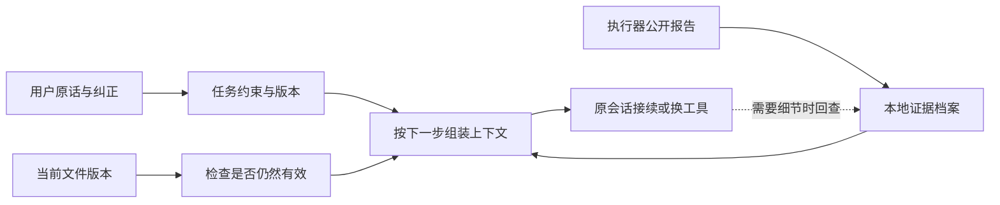

# Bobo 长程工作记忆：研究、实现与小试验

检索与验证日期：2026-10-04。这是一份面向产品决策的定向调研，覆盖到 2026 年 9 月的新研究，不是穷尽性系统综述。论文与作者官方工程资料分别核对，发表状态、评测范围和 Bobo 的实现推论分开陈述。学术 MCP 未提供，检索脚本因本地运行环境/参数问题未提供有效结果；以下依据均来自直接核实的论文、会议与厂商原始页面。

**值得做，但目标应是“恢复时拿到正确、最新、足够的工作状态”，而不是追求最高压缩率。** 没有证据证明一种记忆方法能在所有模型、任务和预算下同时最快、最便宜、最可靠。Bobo 的机会是跨工具维护可核查的工作连续性；文件记忆、摘要和自动压缩本身已经是业界常见能力。

## 1. 真实痛点

| 痛点 | 长任务里的表现 | 设计要求 |
| --- | --- | --- |
| 装得下，仍用不好 | 早期例外、否定约束被大量日志淹没 | 任务目标和硬约束独立保存；不要每轮塞全部日志 |
| 摘要累积失真 | “暂时没有失败”变成“已验证成功”，数字、路径、例外消失 | 原文作依据，摘要/摘录只是可替换的视图；必须能回查 |
| 记得过去，误判现在 | 文件已被用户改动，仍依赖旧的测试通过；后来纠正被旧决定覆盖 | 绑定版本、时间和来源，支持覆盖、撤销与失效 |
| 压缩省输入，增加总工作 | 摘要器调用、缓存失效、重新读文件、重复尝试抵消收益 | 统计全链路 Token、实际费用、延迟、重复行动和人工时间 |
| 检索命中，但没有帮助行动 | 找到了相似聊天，没找到此刻的阻塞、交付要求或失败办法 | 按任务阶段和下一步用途取信息；隔离不同项目 |
| 记忆更新跟不上执行 | 异步整理未完成，新 Agent 先读了旧记忆 | 用户纠正和原始事件先同步保存，整理进度必须可见 |
| 外层看不到内部 | Bobo 只能看到 CLI 公开输出，未必拿到工具轨迹或压缩前上下文 | 按适配器实际可观察范围承诺，不声称改进了原工具内部算法 |

## 2. 学术成果：哪些结论值得采用

| 工作与状态 | 证据 | 对 Bobo 的意义与限制 |
| --- | --- | --- |
| [The Complexity Trap](https://arxiv.org/html/2508.21433v3)，NeurIPS 2025 DL4C workshop | SWE-agent / SWE-bench Verified、五种模型配置。旧工具观察值遮蔽与 LLM 摘要效果接近，多数配置成本约减半；摘要并没有稳定优势，某些配置拉长行动轨迹。 | 必须比较简单基线。不能推导成“所有旧信息都可以删”，也不是 NeurIPS 主会的普适结论。 |
| [ACON](https://proceedings.mlr.press/v306/kang26b.html)，ICML 2026 | 从完整上下文成功、压缩上下文失败的轨迹中学习压缩指南；AppWorld、OfficeBench 等报告峰值输入 Token 降低 26–54%。 | 借鉴失败驱动的压缩评估。峰值输入减少不等于总成本减少；不必先训练压缩器。 |
| [Beyond Token Savings](https://arxiv.org/html/2609.32961v1)，2026-09-26 预印本 | 三种开放模型、两个代码/终端基准，近 35,000 次运行。有些 Qwen / Terminal-Bench 策略只用约三分之一 Token，却慢 20–80%；策略排名随模型和任务改变。 | 不以压缩比作唯一目标。论文费用是按缓存假设重建的输入成本，排除输出费用，不是实际账单。 |
| [PAIR](https://arxiv.org/html/2609.36526v1)，2026-09-29 预印本 | 从同一执行状态分叉继续，定位单次压缩损伤并改模板。AppWorld 上稳定成功有改善；其他部分比较置信区间含零，τ² Retail 上 Token 还可增加约 12%。 | 学习同断点对照，测多次均成功的可靠性，不能称为已解决所有长程任务。 |
| [LongMemEval](https://proceedings.iclr.cc/paper_files/paper/2025/file/d813d324dbf0598bbdc9c8e79740ed01-Paper-Conference.pdf)，ICLR 2025；[V2](https://arxiv.org/html/2605.12493v1)，2026 预印本 | 前者测提取、多会话推理、时间、更新和拒答；V2 加入环境状态、流程与陷阱。V2 文件式 AgentRunbook-C 的平均问答准确率 72.5%，最强 RAG 基线 48.5%，原版 coding-agent 基线 69.3%。 | 可借用纠正、时间、不可回答等测试类型，但问答准确率不等于真实工作完成率；文件回查也有延迟。 |
| [Agent Memory: Characterization and System Implications](https://arxiv.org/html/2606.06448v1)，2026-06 预印本 | 比较十类记忆系统；在特定回放中，复杂写入可导致同步等待或异步积压，继而读到旧记忆。 | 先同步保存事实与纠正，后续再做异步整理；不能把单次回放的速度排名外推到所有产品。 |
| [ReasoningBank](https://arxiv.org/html/2509.25140v1)，[Google Research 论文说明](https://research.google/blog/reasoningbank-enabling-agents-to-learn-from-experience/) | 从成功和失败轨迹提炼策略。Gemini 2.5 Flash / SWE-bench Verified：成功率 34.2%→38.8%，平均行动步数 30.3→27.5。 | 这是更接近工作执行的证据。适合后续研究“有适用条件的失败经验”，但仍要计算整理/检索成本，不能只信 Agent 自评。 |
| [MemoryArena](https://arxiv.org/html/2602.16313v2)，2026 预印本 | 前后依赖的多会话任务，要求记忆影响后续行动；对话记忆高分不保证其任务表现。 | 后续正式验证应采用这种思路，不能只测“保存一句话后能否立即找回”。 |

常见的 [MemoryBank](https://ojs.aaai.org/index.php/AAAI/article/view/29946)（AAAI 2024）、[Mem0](https://arxiv.org/html/2504.19413v1) 和 [A-MEM](https://proceedings.neurips.cc/paper_files/paper/2025/hash/19909c36f51abc4856b4560aff3d36d6-Abstract-Conference.html)（NeurIPS 2025）分别提供陪伴偏好、事实更新检索、原子笔记关联等思路。它们的重要证据以长期聊天/问答为主；Mem0 的大量 Token 节省主要对比全量聊天上下文，不能照搬为“给 Codex 加上后就省同样比例”。复杂图记忆也需要额外写入、检索和去重成本。

## 3. 工业界已经做到了什么

- **原始记录和当前上下文分离。** [Anthropic Managed Agents，2026-04-08](https://www.anthropic.com/engineering/managed-agents) 将持久事件日志与模型当前窗口分开，压缩后仍可按事件回查。[LangChain Deep Agents，2026-01-28](https://www.langchain.com/blog/context-management-for-deepagents) 先外置大工具结果，再在必要时摘要，保留原消息。共同点是可回查，不是只留一段摘要。
- **状态文件和验收比聊天回忆更贴近工作。** [Anthropic 长程 harness，2025-11-26](https://www.anthropic.com/engineering/effective-harnesses-for-long-running-agents) 使用需求清单、进度记录、Git 和验证跨窗口接班。[2026-03-24 的后续案例](https://www.anthropic.com/engineering/harness-design-long-running-apps) 也提醒：模型变强后，旧的强制重置和分段机制可能变成负担；更复杂的编排可能质量更好但成本高很多。
- **缓存也是记忆成本的一部分。** [Manus，2025-07-18](https://manus.im/blog/Context-Engineering-for-AI-Agents-Lessons-from-Building-Manus) 强调稳定前缀、追加上下文、保留失败和外置大内容。[Claude context editing 文档](https://platform.claude.com/docs/en/build-with-claude/context-editing) 明确旧工具结果清理会影响后续缓存复用。它们支持少做无谓改写，而不是每轮重新总结所有东西。
- **整理长期经验是独立阶段。** [Anthropic Dreaming，2026-05-19](https://claude.com/blog/new-in-claude-managed-agents) 以研究预览形式异步去重、修正旧记忆并生成新 store。它会消耗模型，不能当作免费的每轮操作。[LangGraph](https://docs.langchain.com/oss/python/langgraph/persistence) 的 checkpoint 与长期 Store 也分别解决执行恢复和跨会话存储，基础设施本身不提供最优记忆选择。
- **少一层提示，也可能更好。** [Deep Agents v0.7，2026-07-29](https://www.langchain.com/blog/deep-agents-v0-7) 将默认 prompt/tools 等基础输入从约 6k 降到 2k；这不是总任务 Token 降低 65%，reward 差异的置信区间跨零。[2026-09-08 的多 Agent context modes](https://www.langchain.com/blog/organizing-context-in-a-multi-agent-harness) 区分继承上下文的 worker 与隔离的 reviewer，跨模型也不能共享 KV cache。
- **OpenAI 有原生压缩接口，但当前网关不能直接假定支持。** [官方 Compaction 文档](https://developers.openai.com/api/docs/guides/compaction) 提供 Responses 服务端阈值压缩和独立 `/responses/compact`，返回不透明压缩状态。Bobo 当前使用用户指定的 Azure 风格 Model Hub Chat Completions；虽然本地 SDK 有 compact 方法，也没有证据表明该网关支持它。因此这次没有换模型、换服务端，或强塞不兼容接口。

## 4. Bobo 的合理落点

建议分四层，不默认增加另一名昂贵的“记忆管理员”。

第一层固定保存用户要求、有效纠正和验收条件；第二层保存有来源的报告与检查记录；第三层按恢复方式、相关性和长度选原文片段；第四层才是未来可选的跨任务经验。经验需要项目作用域、适用条件、证据、有效期和撤销；目前不自动把某次临时要求永久写成用户偏好。

这能形成可验证的产品差异：用户在工作中途纠正过什么、哪些产物仍然有效、哪些路线已经失败，换工具后不用重新解释。是否最终比直接使用原工具更好，必须通过任务对照证明，不能凭架构图认定。

## 5. 本轮已实现

1. **原话保留。** 调度创建任务时保存当前用户原始消息和派发需求，首次执行也带上相关约束，明确只做派发范围内的子任务。
2. **纠正持续生效。** 手动接续的补充要求进入任务纠正记录，多次换工具后仍保留；自动恢复提示不升格为用户要求。撤销会明确传给原生会话，避免旧历史里的要求继续生效。
3. **报告可回查。** 公开报告脱敏后独立存入任务档案；显示结果仍可短，但 Bobo 可分页读原文。每份有来源、哈希和派生路径，档案损坏明确报错。不会保存隐藏推理、加密推理字段或任意工具日志。
4. **保留首尾与相关片段。** 跨工具恢复优先选原文首尾、当前问题相关内容、阻塞与失败片段，带字符偏移和档案引用；最近报告默认选取最多 1800 字符，其他报告共享剩余预算。原生会话恢复跳过重复报告，继续带上用户要求。
5. **旧证据可失效。** 恢复、查询结果和任务面板都按文件哈希判断检查是否仍有效。改变、删除或无法核实时不继续显示为当前有效的通过。
6. **边界可见。** 交接目标约 12000 字符，是软目标、不是 Token 估算；硬性要求超出时完整保留并明确标记。报告档案最多约 128000 字符；溢出时保留早期片段和最新末尾，标记不完整。工作目录保存规范路径，符号链接改指其他项目不能绕过接续范围。

这是一套可追溯的任务记忆与恢复上下文装配，尚不是通用语义记忆系统。它没有改写 CC/Codex/Trae 的内部窗口，没有导入任意 IDE 既有会话，也没有全量保存任务创建前的长期闲聊。较早的旧版报告若已被截断，不能凭空恢复。

## 6. 本次实际对照：只测上下文保真

已用配置的 Model Hub 执行，返回模型名 `gpt-5.6-sol-2026-07-09`。三条人为构造的源轨迹：报告末尾阻塞、后期用户纠正、旧检查后文件改变。每种方法看到同一源记录的不同视图，使用同一后续问题、模型和输出参数；四臂交叉顺序，各跑一次。模型只给出下一步 JSON 决策，按确定性规则和来源引用检查。

| 方法 | 下一步判断符合预期 | 实际总 Token | 其中摘要 Token | 模型调用累计耗时 |
| --- | ---: | ---: | ---: | ---: |
| 全部源记录 | 3/3 | 5304 | 0 | 6.60 秒 |
| 只保留前 4000 字符 | 0/3 | 3494 | 0 | 9.89 秒 |
| LLM 摘要后判断 | 3/3 | 6261 | 5286 | 12.54 秒 |
| 结构化源字段＋原文摘录 | 3/3 | 2521 | 0 | 6.24 秒 |

总共 17580 个已回报 Token，无未知用量、无选择性重跑。摘要生成调用计入摘要组；未配置费用表，不能当作金额比较。

**这些是刻意触发信息遗失的合成微测，没有统计显著性，不能解释为真实长任务成功率提升或普遍节省比例。** 后一组的结构化字段来自所有组共同拥有的合成源事件，但此次没有测真实日志能否可靠提取这些字段；也没有执行真实代码任务、测原生压缩、包含工具检索或人工干预。全量和普通摘要也都答对了。它只支持“截头容易丢关键内容，保留来源与更新关系值得继续验证”这一有限结论。

实现验证已通过 **62 项单元测试、TypeScript/Vite 构建和四套 Electron 回归**，覆盖原话保留、多次接续、撤销、哈希失效、长报告尾部、权限/路径、档案校验、桌面展示和自动恢复。Electron 接续测试中的模拟 CLI 实际读取档案并核对哈希，没有只检查提示词字符串。

另用本机真实 Trae / Coco 做了隔离的只读验证：读取临时工作目录之外的 Bobo 档案，返回只存在于档案中的随机标记，任务完成。该次 CLI 回报输入 39125、输出 209 Token，单独计量，未混入上表；其费用字段为 0，不能据此认定实际免费。临时数据已清理，没有读取真实用户项目产物。它验证了当前 Trae 环境的档案回查路径，不代表其他 CLI 或其他权限环境已全部验证。这类回归与模型工作能力评测是两件事。

## 7. 下一阶段如何证明价值

选择真实任务，先在相同环境和同一断点分叉：同工具原生继续、全量交接、简单近期窗口＋档案、当前结构化记忆、按需摘要。固定模型、工具权限、文件初态、尝试上限；至少每题重复三次，开发集与最终测试集分开，逐例报告得失。

优先场景是跨小时改代码、带多轮用户纠正的研究交付、中断后换工具、外部文件改变、早期精确信息在末期才使用。指标以客观验收、三次全成功比例、违反约束、重复行动、人工干预分钟和恢复到有效下一步的时间为主。将执行器、Bobo、摘要与检索全部 Token、可得费用、缓存与墙钟时间算入，未知成本标未知，同时报告总成本／成功任务数。

只有这一步显示稳定收益，才值得进一步加语义检索、失败经验库或 ACON/PAIR 式提示优化；若简单方案已经足够，就保留简单方案。

## 8. 后续真实文件试验

2026-10-04 后续执行了小项目文件操作试验，详情见 [真实工作试验与修正](real-work-memory-evaluation.md)。发现 Trae 的 ApplyPatch 工具名单匹配故障并修复；固定模型试验中 Bobo 完成了三项代码／产物验收，但完整的重复对照因预算门槛未完成，在两个有完整报告对照的任务上 Bobo 用量更高。因此继续保持“不宣称提高成功率或节省比例”的结论，并精简执行器收到的管理元数据。
